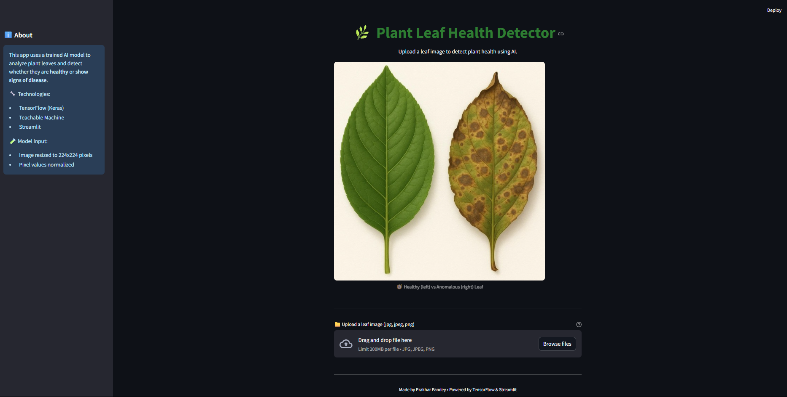
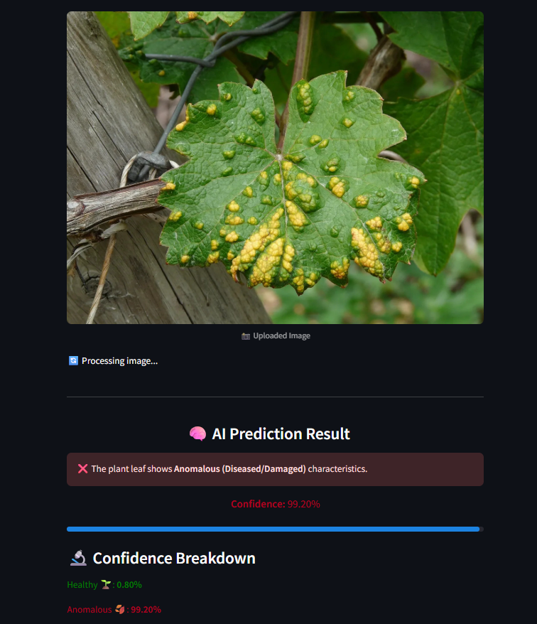

# 🌿 Plant Leaf Health Detector

An AI-powered web app that detects whether a plant leaf is healthy or showing signs of disease. Built with **Python**, **Streamlit**, and a model trained using **Teachable Machine**.

---

## ✅ Features

- Upload a plant leaf image (.jpg, .jpeg, .png)
- Get instant prediction: **Healthy** or **Anomalous**
- Displays clear result with confidence score
- Clean, responsive UI

---

## 🖼️ Screenshots

  
  

---

## ⚙️ Tech Stack

- Python  
- Streamlit  
- TensorFlow (via Teachable Machine)  
- PIL & NumPy (for image processing)

---
